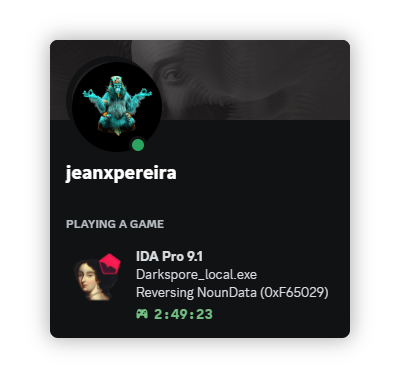

<h1 align="center">Discord Rich Presence for IDA 9.1</h1>
<p align="center"></p>

## About
ida-rpc was a quick plugin to see what changed in the 9.1 sdk,
it allows for [discord rich presence](https://discordapp.com/rich-presence) to display information about the current IDA session

## Installation
To install ida-rpc simply copy **ida-rpc64.dll** from the [latest release](https://github.com/shikataganaii/ida-rpc-ida9/releases) to ```ida_install_location/plugins/``` ,
to change options within the plugin open the plugins menu and select IDA RPC ```Edit -> Plugins -> IDA RPC``` or use the default hotkey ```Ctrl-Alt-R```

## Building
To build this solution you'll need to get a copy of the [IDA 9.1 SDK](https://my.hex-rays.com/dashboard/download-center/9.1/sdk-and-utilities), add to enviroment and include directories to Visual Studio project, compile in 64bit Release64 and your done!

## Credits
- [Fork of shikataganaii has ported to 9.1](https://github.com/shikataganaii/ida-rpc-ida9)
- [Original project](https://github.com/ntpopgetdope/ida-rpc)